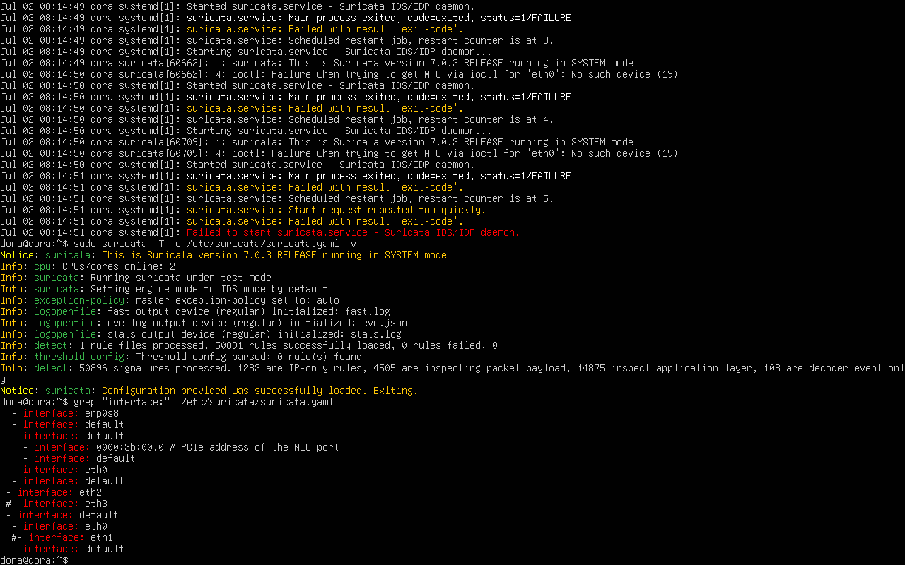

# 🛡️ SOC Home Lab — Network Threat Detection with Suricata + Zeek

> A fully functional SOC detection lab built on VirtualBox simulating real-world attacker activity and defender monitoring using open-source IDS/NSM tools.


---

## 📌 Project Overview

This lab simulates a blue team detection environment where:
- A **Kali Linux** attacker performs reconnaissance and SMB enumeration against a **Windows 10** target
- An **Ubuntu defender** running **Suricata 7.0.3** (IDS) and **Zeek 8.0.8** (NSM) monitors all traffic in real time
- Real alerts are triggered, logged, and analysed — mirroring what a SOC Analyst does daily

**Result:** 7 distinct Suricata alert signatures fired. Zeek generated structured logs across 12 log types including `conn.log`, `dns.log`, `dhcp.log`, `weird.log`, and `notice.log`. Every attacker move was detected.

---

## 🗺️ Lab Architecture

```
┌──────────────────────────────────────────────────────┐
│             VirtualBox Host-Only Network             │
│                  192.168.56.0/24                     │
│                                                      │
│  ┌──────────────┐      ┌──────────────┐              │
│  │  Kali Linux  │      │  Windows 10  │              │
│  │  (Attacker)  │─────▶│   (Target)   │             │
│  │192.168.56.103│      │192.168.56.102│              │
│  └──────┬───────┘      └──────┬───────┘              │
│         │                     │                      │
│         └──────────┬──────────┘                      │
│                    ▼                                 │
│         ┌──────────────────────┐                     │
│         │   Ubuntu — Dora      │                     │
│         │   DEFENDER / NSM     │                     │
│         │  192.168.56.104      │                     │
│         │                      │                     |
│         │  • Suricata 7.0.3    │                     │
│         │  • Zeek 8.0.8        │                     │
│         │  • tcpdump           │                     │
│         │  • interface enp0s8  │                     │
│         └──────────────────────┘                     │
│                                                      │
│   DHCP Server: 192.168.56.100                        │
└───────────────────────────────────────────────────────┘
```

---

## 🖥️ Lab Machines

| Machine | OS | IP | Role |
|---|---|---|---|
| Dora (Defender) | Ubuntu 24.04 | 192.168.56.104 | IDS / NSM Monitor |
| Kali (Attacker) | Kali Linux 2026 | 192.168.56.103 | Attacker |
| Client (Target) | Windows 10 Pro 17763 | 192.168.56.102 | Target |
| DHCP Server | VirtualBox Host | 192.168.56.100 | DHCP |

---

## 🧱 Phase 1 — Setting Up the Network

### Ubuntu Defender — IP Configuration


> Ubuntu (Dora) has two interfaces: `enp0s3` (NAT, internet) and `enp0s8` (host-only, DOWN initially). Suricata and Zeek are configured to sniff on `enp0s8`.

---

### Kali Attacker — IP Configuration


> Kali has `eth0` (NAT) and `eth1` (host-only, no IP assigned — receives address dynamically via DHCP from the host-only network).

---

### Windows 10 Target — IP Configuration


> Windows has two adapters. Ethernet 2 is on the host-only network at `192.168.56.102`. Open ports: **135** (MSRPC), **139** (NetBIOS), **445** (SMB).

---

## ✅ Phase 2 — Verifying Connectivity

### Ubuntu ↔ All Machines


> Ubuntu successfully pings both Windows (192.168.56.102) and Kali (192.168.56.103). TTL=128 from Windows confirms Windows target. TTL=64 from Kali confirms Linux.

---

### Kali ↔ All Machines


> Kali reaches both targets. 0% packet loss, sub-3ms latency — network is healthy and ready for attack simulation.

---

### Windows ↔ All Machines


> Windows 10 successfully pings Kali (192.168.56.103) and Ubuntu (192.168.56.104). Full three-way connectivity confirmed.

---

## ⚙️ Phase 3 — Installing & Configuring Suricata

### Suricata Installation


> Suricata 7.0.3 installed. Output shows all build parameters — Python support, PCAP, Rust 1.75.0, DPDK Bond PMD enabled. Log directory: `/var/log/suricata/`.

---

### Suricata Configuration (`/etc/suricata/suricata.yaml`)


> `HOME_NET` set to `[192.168.0.0/16,10.0.0.0/8,172.16.0.0/12]` covering the lab subnet. Server groups (HTTP, SMTP, SQL, DNS) all resolve to `$HOME_NET`.

---

### Troubleshooting — Interface Fix



> **Problem:** Suricata was crashing with `ioctl: Failure when trying to get MTU via ioctl for 'eth0': No such device (19)`.  
> **Fix:** Grep revealed multiple interface references in the YAML. Updated all to `enp0s8` (the actual NIC). Config validated with `suricata -T -c /etc/suricata/suricata.yaml -v` — **50,896 signatures successfully loaded**.

---

### Suricata Running


> `systemctl status suricata` → **active (running)**. Suricata 7.0.3 in SYSTEM mode. PID 61075. Memory: 280MB. Running since `2026-07-02 08:38:41 UTC`.

---

## ⚙️ Phase 4 — Installing & Configuring Zeek

### Zeek Installation


> Zeek 8.0.8 installed via apt. All dependencies resolved: `zeek-8.0-core`, `zeek-8.0-spicy-dev`, `zeekctl-8.0`. Final confirmation: `/opt/zeek/bin/zeek version 8.0.8`.

---

### Zeek Node Configuration (`/opt/zeek/etc/node.cfg`)


> Zeek configured as `standalone` node on `localhost`, sniffing interface `enp0s8`. Clustered config (logger/manager/proxy/worker) left commented out — not needed for single-node lab.

---

## ⚔️ Phase 5 — Simulating Attacks

### Attack 1 — ICMP Host Discovery (Ping)


> Kali sends 15 continuous ICMP packets to Windows (192.168.56.102). TTL=128 confirms Windows target. Average RTT: 1.389ms. This generates ICMP traffic for Suricata and Zeek to log.

---

### Attack 2 — Kali Continuous Ping (50+ packets)


> Extended ping run — 50 ICMP packets, all successful. TTL=128 consistent. This volume of ICMP triggers Suricata's ICMPv4 anomaly rule.

---

### Attack 3 — Nmap Aggressive Scan (`-A`)


> `sudo nmap -A 192.168.56.102` — Full OS detection + service version + script scan.  
> **Results:** Windows 10 Pro 17763 (97% confidence), hostname **CLIENT**, WORKGROUP domain, clock skew 2h19m.  
> **Open ports:** 135/msrpc, 139/netbios-ssn, 445/microsoft-ds.  
> SMB script: OS confirmed Windows 10 Pro 6.3.

---

### Attack 4 — Nmap Service Version Scan (`-sV`)


> `nmap -sV 192.168.56.102` — Service banner grabbed from each open port.  
> 445/tcp: **Microsoft Windows 7–10 microsoft-ds** (workgroup: WORKGROUP).  
> Host: CLIENT | OS: Windows.

---

### Attack 5 — Zeek Observing from Kali Side


> Kali's own conn.log view during the nmap scan — shows the hundreds of TCP SYN connections Kali is sending to the target, from the attacker's perspective.

---

## 🚨 Phase 6 — Suricata Alert Results

### Alert Log — fast.log


> First alert: `07/02/2026-08:42:26` — **ET INFO Possible Kali Linux hostname in DHCP Request** (rule 2022973, Priority 1). Kali's machine name leaked in its own broadcast before any attack started.

---

### Alert Log — ubuntu_capturing (Full Alert Timeline)


> **Full alert chain captured in sequence:**
>
> | Time | Alert |
> |---|---|
> | 08:42:26 | Kali hostname in DHCP (Priority 1) |
> | 08:47:26 | Kali hostname in DHCP (repeat) |
> | 08:49:19 | Applayer Mismatch — port 135 |
> | 08:49:20 | ICMPv4 unknown code (ping) |
> | 08:49:22 | ICMPv4 unknown code (ping repeat) |
> | 08:49:24 | SMB malformed dialect (×3) |
> | 08:49:24 | NTLM Negotiate |
> | 08:49:24 | NTLMv1 Challenge |
> | 08:49:24 | NTLM Auth |
> | 08:49:29–30 | SMB malformed dialect (final burst) |

---

## 🔍 Phase 7 — Zeek NSM Results

### Zeek Log Files Generated


> `/opt/zeek/logs/current/` — 12 active log files:
>
> | Log | Size | Contents |
> |---|---|---|
> | conn.log | 462 KB | All network connections |
> | telemetry.log | 383 KB | Zeek internal metrics |
> | dns.log | 43 KB | DNS queries |
> | loaded_scripts.log | 34 KB | Active scripts |
> | dhcp.log | 2.9 KB | DHCP lease activity |
> | notice.log | 937 B | Notable events |
> | weird.log | 365 B | Protocol anomalies |
>
> `conn.log` live tail shows DNS queries to `224.0.0.252` (mDNS) and DHCP broadcasts from Kali (.103) — baseline noise captured before attacks.

---

### Zeek conn.log — Ping Detection


> Zeek's conn.log shows the DHCP broadcast from Kali (192.168.56.103:68 → 192.168.56.100:67) with `SHR` history flags — DHCP handshake captured. This is the same event that triggered Suricata rule 2022973.

---

### Zeek conn.log — Nmap SYN Scan Fingerprint


> **The unmistakable nmap SYN scan signature in Zeek:**
> - Source: `192.168.56.103` (Kali)
> - Destination: `192.168.56.102` (Windows) across **sequential high ports**
> - State: `S0` on every connection (SYN sent, no response — filtered ports)
> - History: `S` only — connection never completed
> - Duration: near-zero milliseconds per connection
>
> This pattern — hundreds of `S0` TCP connections from one source in under 1 second — is the definitional fingerprint of a SYN scan, fully readable in Zeek's structured conn.log without any Suricata rule required.

---

### tcpdump Packet Capture


> `sudo tcpdump -i enp0s8 host 192.168.56.103` captures raw HTTP SYN packets from Kali (port 41696) → Windows (port 80). Also shows ARP request/reply cycle as Kali resolves Windows' MAC address (`08:00:27:D4:18:D3`). Confirms all three tools (Suricata + Zeek + tcpdump) are watching the same interface simultaneously.

---

## 🧠 MITRE ATT&CK Mapping

| Technique | ID | Evidence |
|---|---|---|
| Network Service Scanning | T1046 | nmap -sS/-sV; Zeek S0 burst pattern |
| Active Scanning — Scanning IP Blocks | T1595.001 | nmap -A; Suricata ICMPv4 alert |
| System Information Discovery | T1082 | nmap OS fingerprint: Windows 10 Pro 17763 |
| SMB / Windows Admin Shares | T1021.002 | Suricata 2225005 SMB dialect alerts |
| NTLM Relay / Auth Probe | T1557.001 | Suricata 2067085/86/87 NTLM chain |
| Attacker Identity Exposure | T1016 | Kali hostname in DHCP — rule 2022973 |

---

## 🔑 Key Security Findings

**1. Attackers expose themselves before the first attack packet.**  
Kali's hostname appeared in its DHCP broadcast — a Priority 1 Suricata alert. In a real SOC, this is your first pivot indicator.

**2. Nmap SYN scans have a clear Zeek fingerprint.**  
Hundreds of `S0` connections to sequential ports in under 1 second from one IP. No signature needed — it's pure behavioral detection.

**3. SMB on port 445 is a rich alert surface.**  
Three separate Suricata rules fired on a single nmap SMB interaction: malformed dialect, applayer mismatch, and NTLM session chain. Any one alone warrants investigation.

**4. NTLMv1 is still active on the Windows 10 target.**  
Suricata rule 2067086 specifically detected NTLMv1 (not v2) — a known relay attack vulnerability. Hardening recommendation: enforce NTLMv2 minimum via Group Policy.

**5. Zeek and Suricata are complementary, not redundant.**  
Suricata caught the WHAT (known bad signatures). Zeek captured the CONTEXT (connection state, byte counts, protocol history, timing). Together they provide the full picture a SOC analyst needs.

---

## 🚀 How to Replicate

### Step 1 — Create the Host-Only Network
```
VirtualBox → File → Network Manager → Host-Only Networks
Subnet: 192.168.56.0/24
DHCP Server: enabled (192.168.56.100)
Assign each VM's 2nd adapter to this network
```

### Step 2 — Install Suricata
```bash
sudo add-apt-repository ppa:oisf/suricata-stable
sudo apt update && sudo apt install suricata -y
sudo suricata-update
# Edit /etc/suricata/suricata.yaml → set interface to your NIC (find with: ip a)
sudo suricata -T -c /etc/suricata/suricata.yaml -v   # validate config
sudo systemctl enable --now suricata
```

### Step 3 — Install Zeek
```bash
sudo apt install zeek-8.0 -y
sudo nano /opt/zeek/etc/node.cfg    # set interface=enp0s8
sudo /opt/zeek/bin/zeekctl deploy
ls /opt/zeek/logs/current/
```

### Step 4 — Run Attacks from Kali
```bash
ping 192.168.56.102
sudo nmap -sS 192.168.56.102
sudo nmap -A  192.168.56.102
nmap -sV      192.168.56.102
```

### Step 5 — Monitor Detections
```bash
# Suricata
sudo tail -f /var/log/suricata/fast.log

# Zeek
sudo -i && cd /opt/zeek/logs/current && tail -f conn.log

# tcpdump
sudo tcpdump -i enp0s8 host 192.168.56.103
```

---

## 📁 Repository Structure

```
soc-home-lab/
├── README.md
└── screenshots/
    ├── server_ip.png
    ├── kali_ip.png
    ├── windows_10_ip.png
    ├── ubuntu_can_talk.png
    ├── kali_talk.png
    ├── windows_can_talk.png
    ├── installing_zeek.png
    ├── suricata_installed.png
    ├── suricata_configuration.png
    ├── conf_zeek.png
    ├── suricata_troubleshoot.png
    ├── suricata_running.png
    ├── generating_traffic.png
    ├── kali_ping_flood.png
    ├── nmap_scan_on_target.png
    ├── nmap_sV_results.png
    ├── zeek_on_kali.png
    ├── suricata_results.png
    ├── ubuntu_capturing.png
    ├── zeek_results.png
    ├── zeek_results_on_ping.png
    ├── zeek_nmap.png
    └── tcpdump_results.png
```

---

## 👤 Author

**Malathi Mittapalli (Enola)** — Aspiring SOC Analyst | VAPT Enthusiast | Blue Team & Threat Hunting

6 months of hands-on cybersecurity internship experience covering network/packet analysis, IDS/firewall operations, VAPT, web application security, and SOC operations. This lab was built to demonstrate practical blue team detection skills — from tool installation and configuration through live attack simulation and alert analysis.

[](https://www.linkedin.com/in/malathi-mittapalli-enola-b73208413)
[](https://github.com/malathi-cyber-sketch)

---

*MIT License — free to use, fork, and build on.*

