# 🛡️ SOC Home Lab — Network Threat Detection with Suricata + Zeek

> A hands-on Security Operations Center (SOC) detection lab where I played both attacker and defender — simulating real reconnaissance activity from Kali Linux against a Windows 10 target, and monitoring, detecting, and analyzing that activity in real time using Suricata (IDS) and Zeek (NSM) on an Ubuntu sensor.


---

## 📌 Why I Built This

Reading about IDS/NSM tools is not the same as running them. I wanted to know, first-hand, what it actually feels like to sit on the defender's side of a SOC: watch an attacker probe a network, catch that activity in an alert feed, and then explain — with evidence — what happened, how, and why it matters.

So I built a three-machine lab from scratch, attacked my own target, and used two industry-standard tools to detect it:

- **Suricata** — signature-based IDS. Answers: *"Is this activity malicious?"*
- **Zeek** — network security monitor. Answers: *"What exactly happened on the network?"*

**Result:** 7 distinct Suricata alert signatures fired across the attack sequence. Zeek generated structured logs across 12 log types (`conn.log`, `dns.log`, `dhcp.log`, `weird.log`, `notice.log`, etc.). Every single attacker action was caught by at least one tool — several were caught by both, which is exactly the kind of overlap a real SOC relies on.

---

## 🗺️ Lab Architecture

```
┌──────────────────────────────────────────────────────┐
│             VirtualBox Host-Only Network             │
│                  192.168.56.0/24                     │
│                                                      │
│  ┌──────────────┐      ┌──────────────┐              │
│  │  Kali Linux  │      │  Windows 10  │              │
│  │  (Attacker)  │─────▶│   (Target)   │             │
│  │192.168.56.103│      │192.168.56.102│              │
│  └──────┬───────┘      └──────┬───────┘              │
│         │                     │                      │
│         └──────────┬──────────┘                      │
│                     ▼                                │
│         ┌──────────────────────┐                     │
│         │   Ubuntu — Dora      │                     │
│         │   DEFENDER / NSM     │                     │
│         │  192.168.56.104      │                     │
│         │                      │                     │
│         │  • Suricata 7.0.3    │                     │
│         │  • Zeek 8.0.8        │                     │
│         │  • tcpdump           │                     │
│         │  • interface enp0s8  │                     │
│         └──────────────────────┘                     │
│                                                      │
│   DHCP Server: 192.168.56.100                        │
└──────────────────────────────────────────────────────┘
```

| Machine | OS | IP | Role |
|---|---|---|---|
| Dora (Defender) | Ubuntu 24.04 LTS | 192.168.56.104 | IDS / NSM sensor |
| Kali (Attacker) | Kali Linux 2026 | 192.168.56.103 | Attacker |
| Client (Target) | Windows 10 Pro (build 17763) | 192.168.56.102 | Target |
| DHCP Server | VirtualBox Host-Only | 192.168.56.100 | Address assignment |

---

## 🧱 Phase 1 — Building the Network

**Tool:** VirtualBox Network Manager (NAT + Host-Only adapters)

**Why:** Every VM needs two separate networks — one to reach the internet for updates and package installs (NAT), and one private, isolated segment where the attacker, target, and sensor can talk to each other without touching the outside world (Host-Only). This isolation is what makes it *safe* to run real attack tools.

**What I did:**
```
VirtualBox → File → Network Manager → Host-Only Networks
Subnet: 192.168.56.0/24
DHCP Server: enabled (192.168.56.100)
Assign each VM's 2nd adapter to this network
```

**Output:**
- Ubuntu (Dora): `enp0s3` (NAT) + `enp0s8` (host-only, sniffing interface)
- Kali: `eth0` (NAT) + `eth1` (host-only, DHCP-assigned)
- Windows 10: Ethernet 2 on host-only → `192.168.56.102`, exposing ports **135 (MSRPC)**, **139 (NetBIOS)**, **445 (SMB)**

| Ubuntu (Dora) IP config | Kali IP config | Windows 10 IP config |
|---|---|---|
| 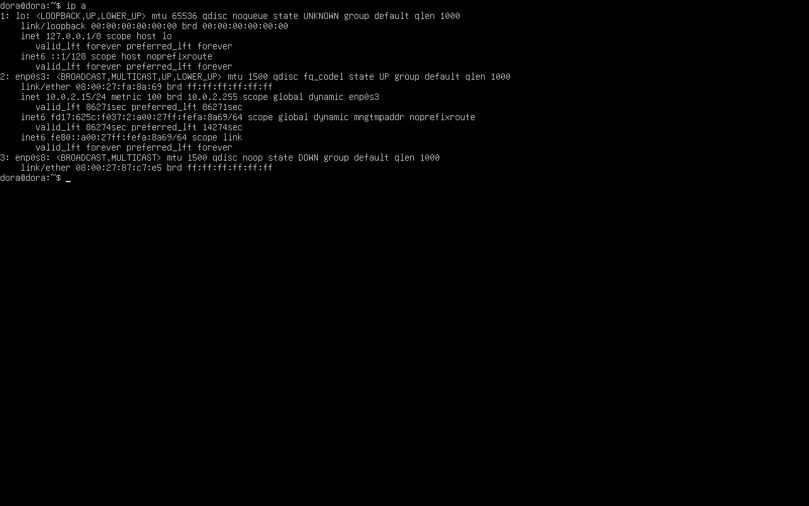 | 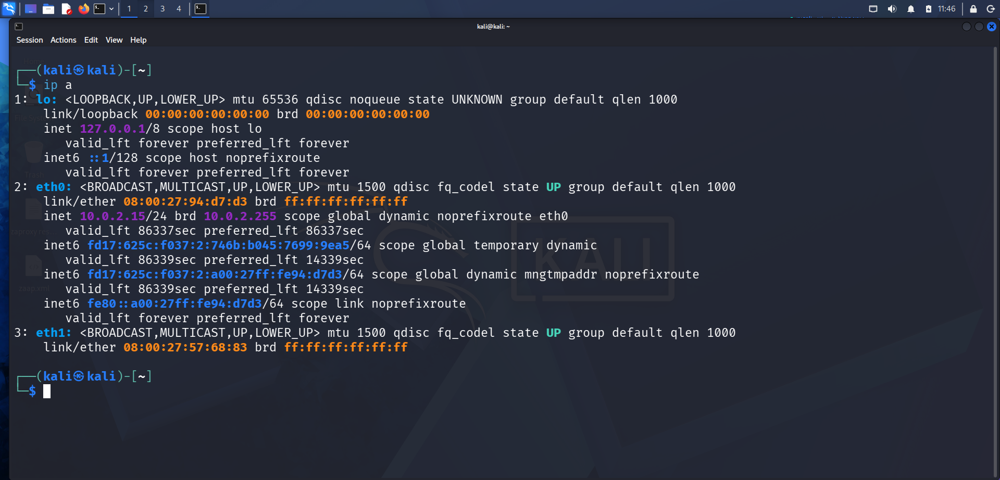 | 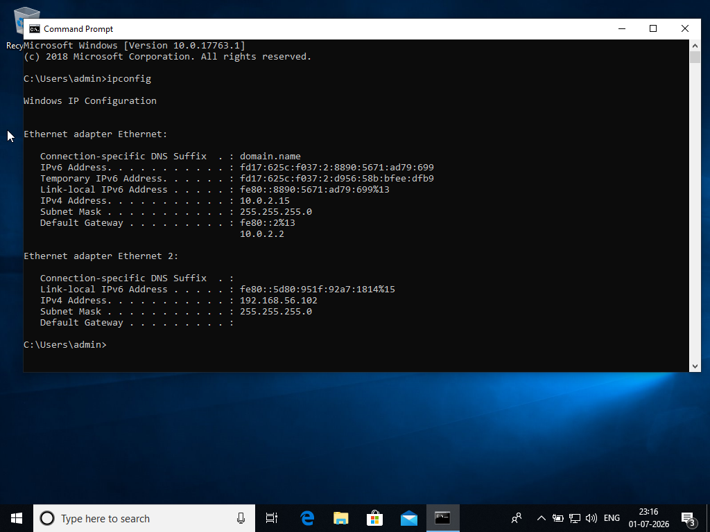 |

---

## ✅ Phase 2 — Verifying Connectivity

**Tool:** `ping`, `ip a`, `ip route`, `nmap -sn`

**Why:** Before trusting any IDS alert, you need to know your baseline network actually works end-to-end. Skipping this step is a classic beginner mistake — you end up debugging your IDS config when the real problem is routing.

**What I did:** Pinged every machine from every other machine on the host-only subnet.

**Output:**
- Ubuntu ↔ Windows/Kali: 0% loss, TTL=128 (Windows) / TTL=64 (Kali) confirming OS fingerprints from TTL alone
- Kali ↔ all: 0% packet loss, sub-3ms latency
- Windows ↔ all: full three-way connectivity confirmed

| Ubuntu ping results | Kali ping results | Windows ping results |
|---|---|---|
| 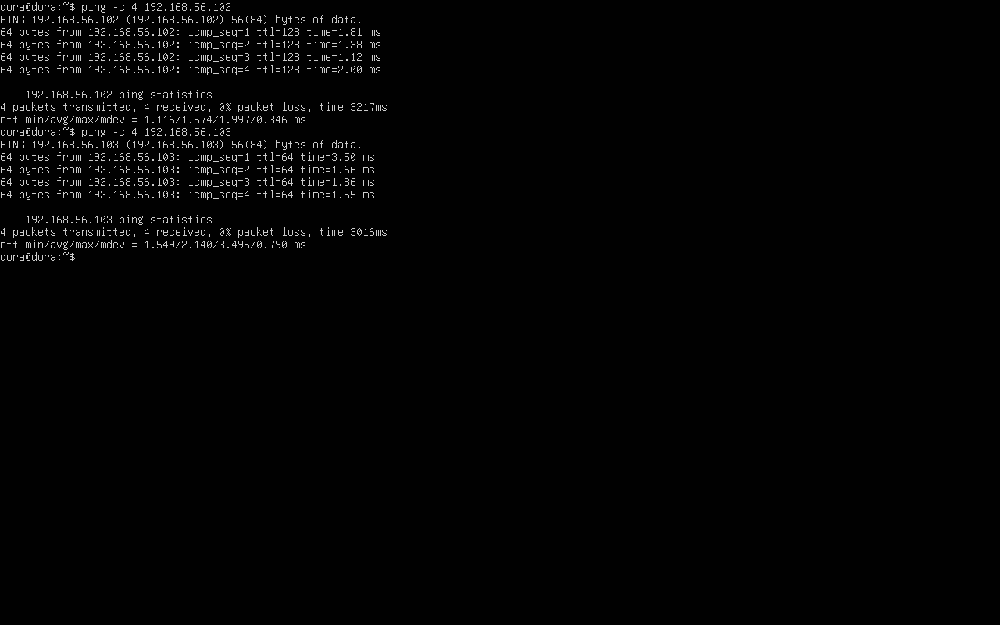 | 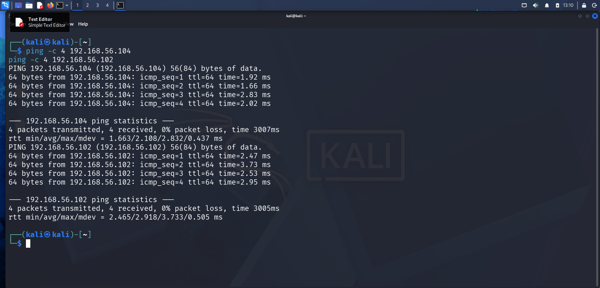 | 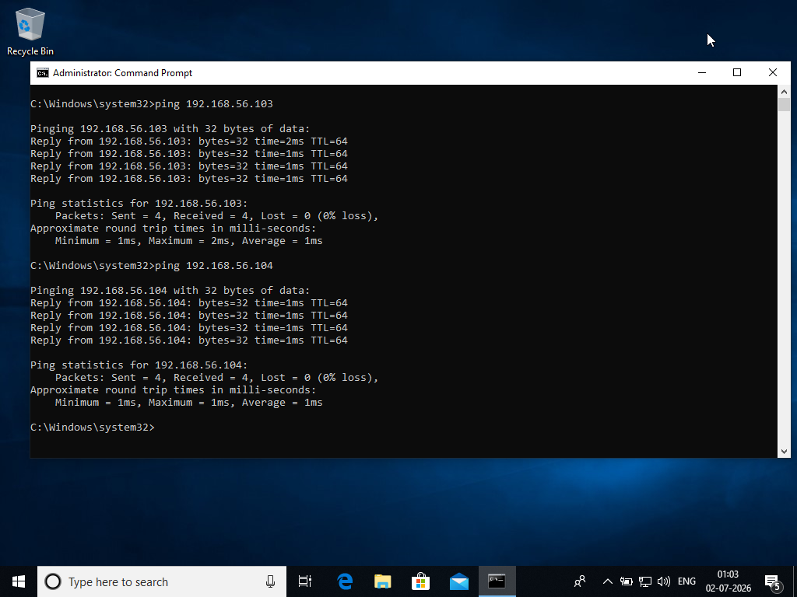 |

---

## ⚙️ Phase 3 — Installing & Configuring Suricata

**Tool:** Suricata 7.0.3 (signature-based IDS)

**Why:** Suricata inspects every packet against tens of thousands of community threat signatures and fires an alert the moment traffic matches a known-bad pattern — port scans, malformed protocol fields, known exploit strings, and more.

**What I did:**
```bash
sudo add-apt-repository ppa:oisf/suricata-stable
sudo apt update && sudo apt install suricata -y
sudo suricata-update
# Edit /etc/suricata/suricata.yaml → set HOME_NET and interface
sudo suricata -T -c /etc/suricata/suricata.yaml -v   # validate config
sudo systemctl enable --now suricata
```

**Output:** `HOME_NET` set to cover the lab subnet. **50,896 signatures** loaded successfully. `systemctl status suricata` → **active (running)**, PID 61075, ~280MB memory.

**Suricata installed:**
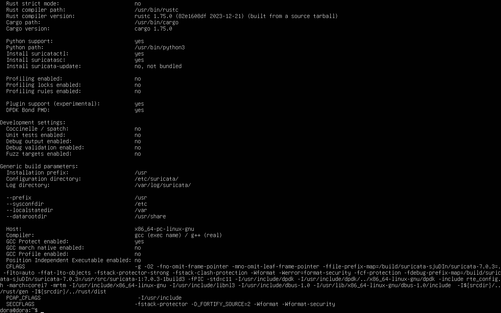

**Suricata configuration (HOME_NET + interface):**
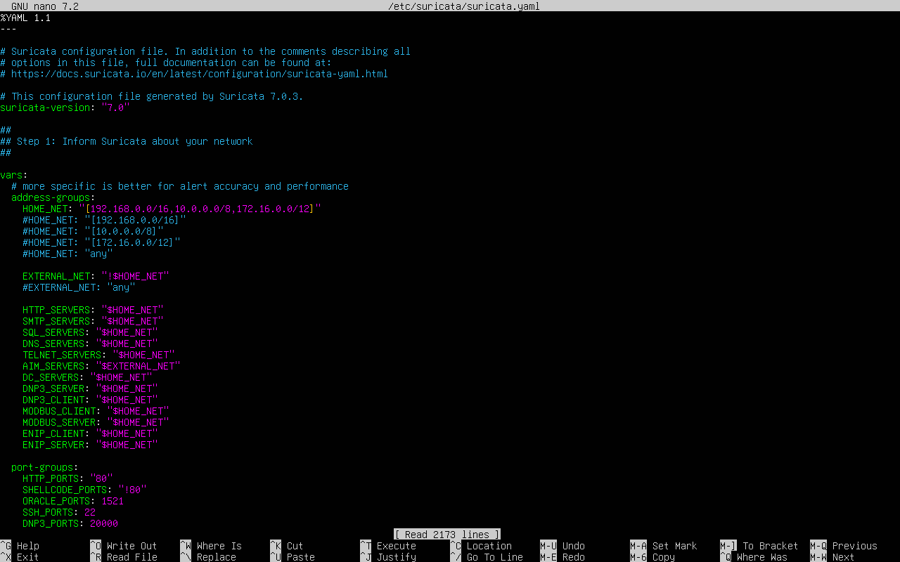

**Suricata running:**
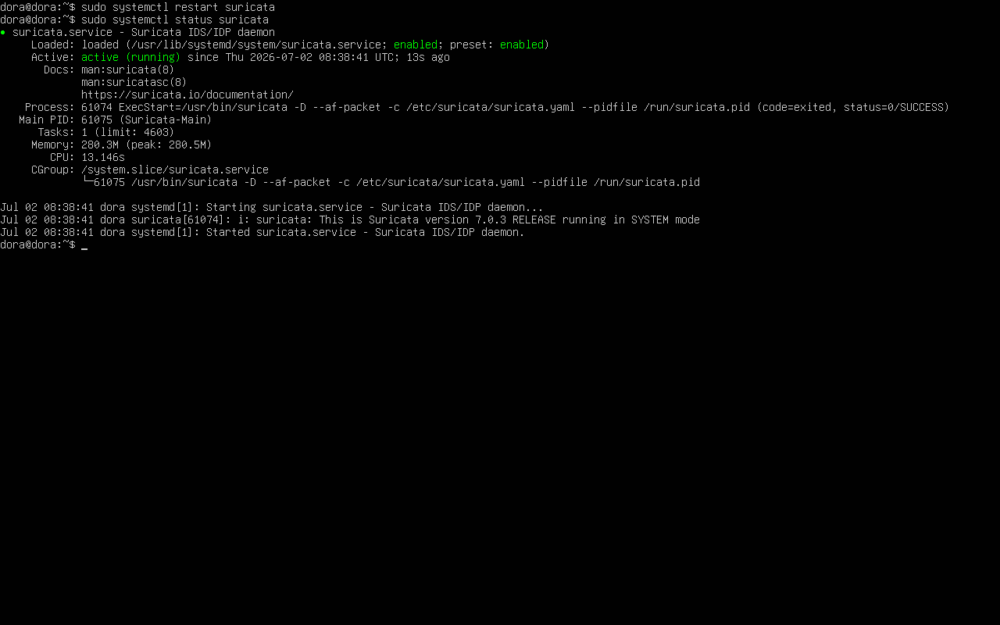

---

## ⚙️ Phase 4 — Installing & Configuring Zeek

**Tool:** Zeek 8.0.8 (network security monitor)

**Why:** Where Suricata tells you *"this matches a bad signature,"* Zeek tells you *everything that happened* — every connection, its duration, byte count, state, and protocol behavior — whether or not it matched a known signature. This is critical for catching activity that has no existing rule.

**What I did:**
```bash
sudo apt install zeek-8.0 -y
sudo nano /opt/zeek/etc/node.cfg    # set interface=enp0s8
sudo zeekctl check
sudo zeekctl deploy
ls /opt/zeek/logs/current/
```

**Output:** Zeek deployed as a standalone node sniffing `enp0s8`. `zeekctl status` → **running**, generating 12 active log types.

**Installing Zeek:**
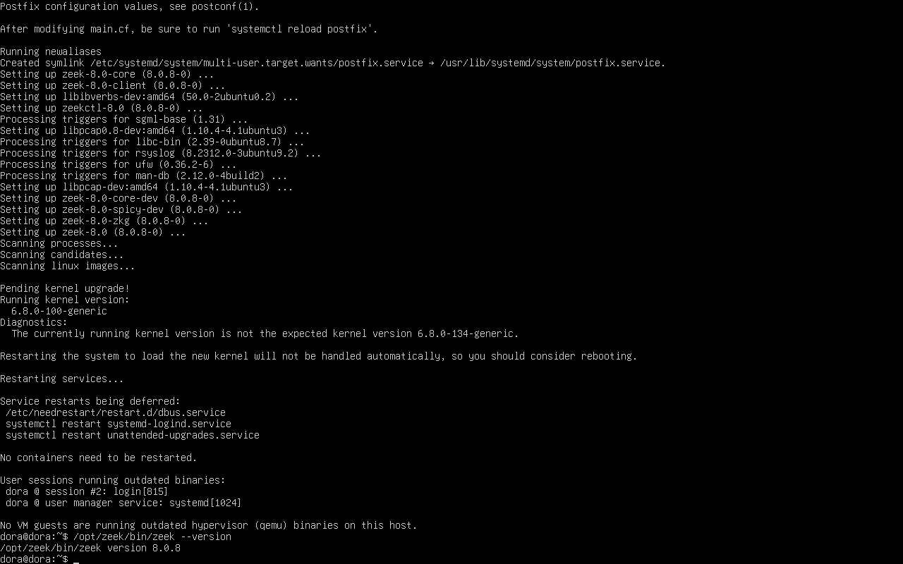

**Zeek node.cfg configuration:**
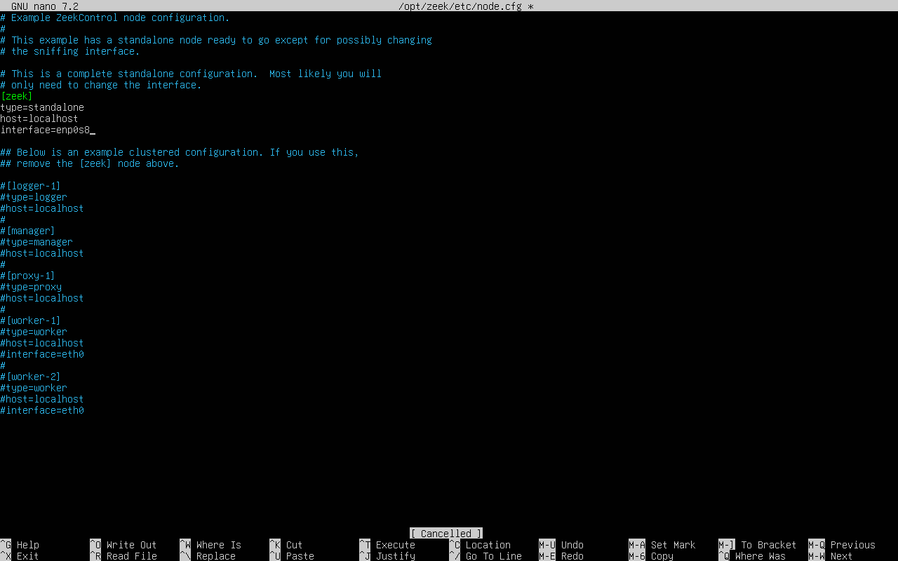

---

## ⚔️ Phase 5 — Simulating Attacker Activity

**Tool:** `ping`, `nmap` (aggressive scan, service version scan, SYN scan)

**Why:** An IDS/NSM stack is only as good as the traffic tested against it. I simulated the exact recon behaviors a real attacker performs in the first minutes of compromising a network: host discovery, port scanning, service fingerprinting, and OS detection.

**What I did (from Kali):**
```bash
ping 192.168.56.102
sudo nmap -sS 192.168.56.102
sudo nmap -A  192.168.56.102
nmap -sV      192.168.56.102
```

**Output:**
- **ICMP sweep:** 15+ then 50+ packets, TTL=128, avg RTT 1.389ms
- **`nmap -A`:** Windows 10 Pro build 17763 identified at 97% confidence, hostname `CLIENT`, WORKGROUP domain, 2h19m clock skew, open ports 135/139/445
- **`nmap -sV`:** Banner-grabbed `Microsoft Windows 7–10 microsoft-ds` on 445/tcp

**Generating traffic from Kali:**
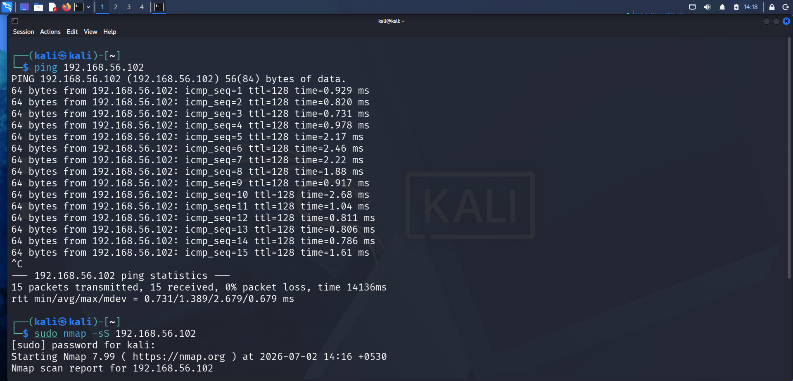

**Ping sweep results:**
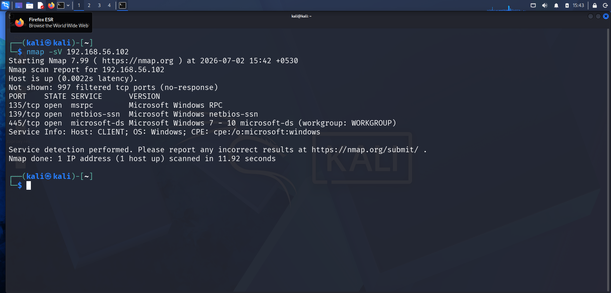

**Nmap scan on target:**
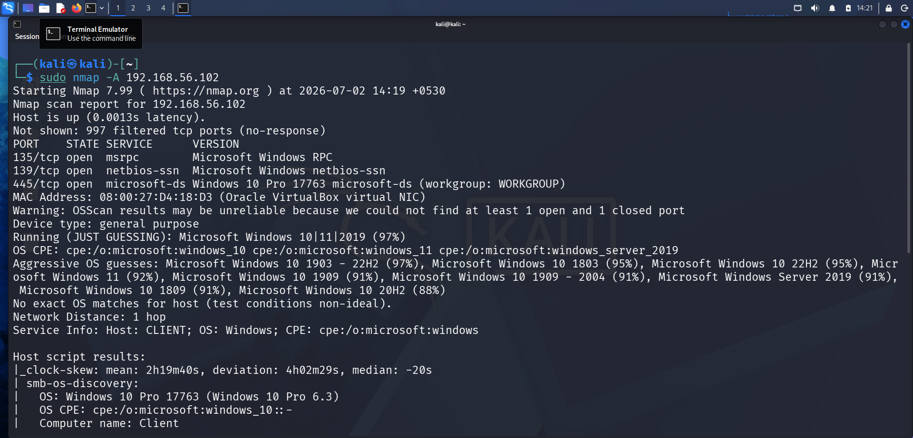

**Nmap -sV service detection results:**
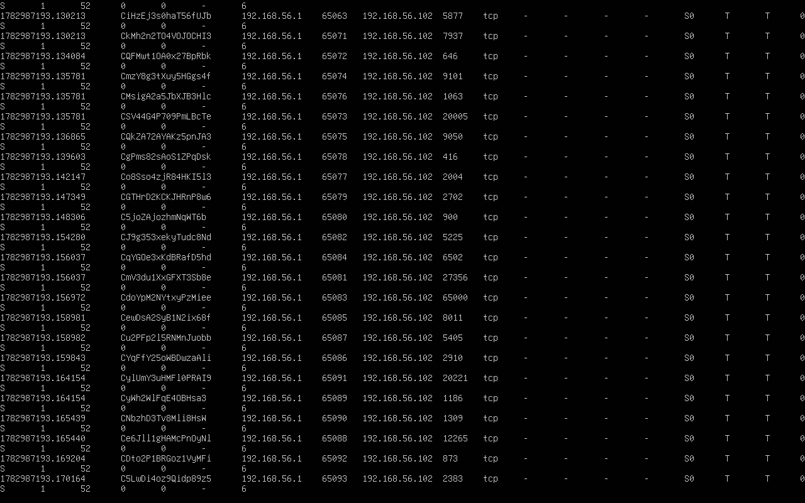

**Zeek view from Kali side:**
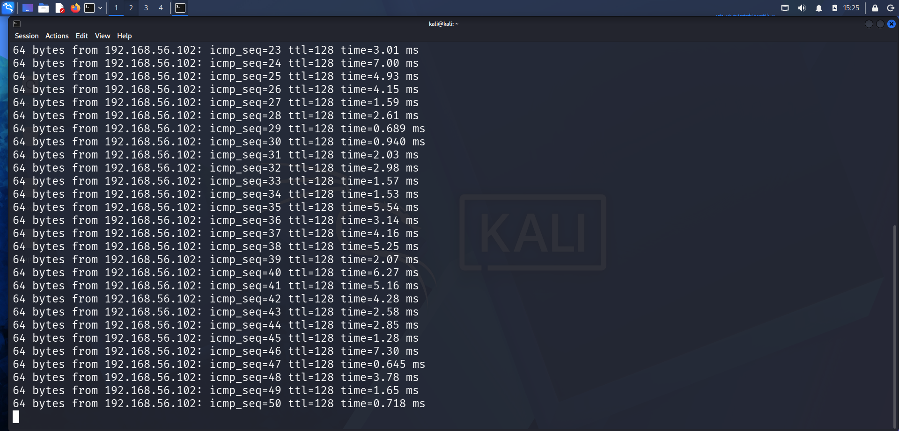

---

## 🚨 Phase 6 — Suricata Alert Results

**Tool:** `fast.log`, `eve.json`

**Why:** This is the payoff — confirming the sensor actually caught what I threw at it, in the right order, with the right severity.

**Output — full alert timeline:**

| Time | Alert |
|---|---|
| 08:42:26 | Possible Kali Linux hostname in DHCP Request (rule 2022973, Priority 1) |
| 08:47:26 | Same alert repeats |
| 08:49:19 | Applayer Mismatch — port 135 |
| 08:49:20–22 | ICMPv4 unknown code (ping sweep) |
| 08:49:24 | SMB malformed dialect ×3 |
| 08:49:24 | NTLM Negotiate → NTLMv1 Challenge → NTLM Auth |
| 08:49:29–30 | SMB malformed dialect (final burst) |

**7 distinct signatures fired** — from an attacker leaking its own identity in a DHCP broadcast before the first scan even started.

**Suricata fast.log alert output:**
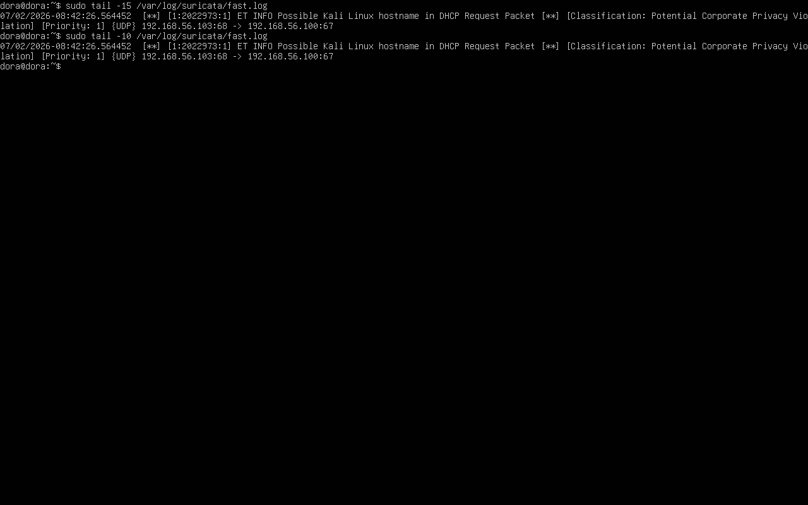

**Ubuntu sensor capturing traffic:**
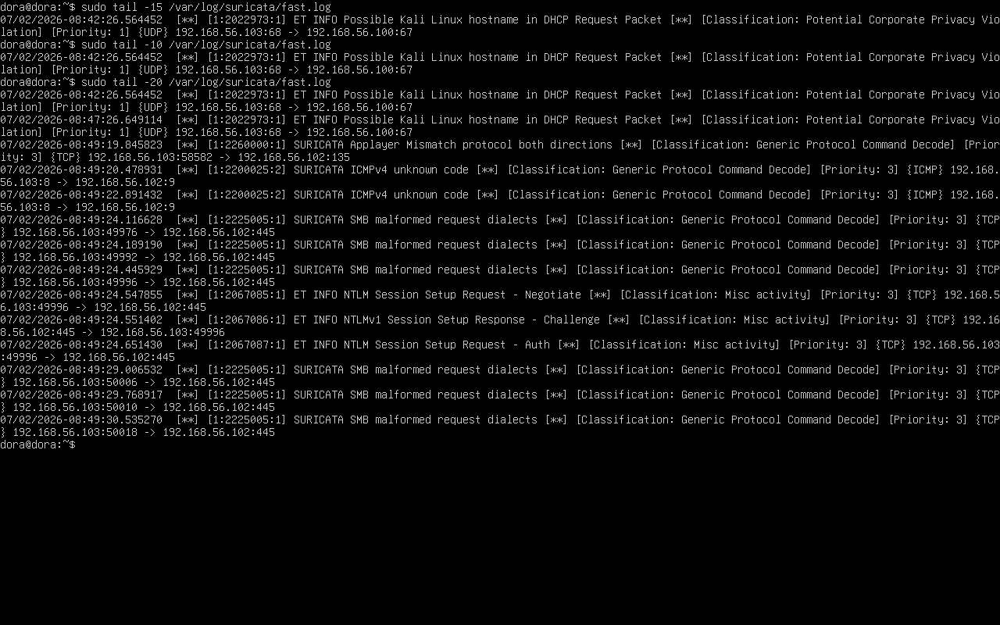

---

## 🔍 Phase 7 — Zeek NSM Results

**Tool:** `conn.log`, `dns.log`, `dhcp.log`, `notice.log`, `weird.log`, `tcpdump`

**Why:** To prove the two tools are complementary — Suricata caught the *what*, Zeek caught the *how*.

**Output:**
- `conn.log` (462 KB) captured the same DHCP handshake that triggered Suricata's rule 2022973 — visible from both angles.
- The nmap SYN scan produced its textbook Zeek fingerprint: hundreds of `S0`-state connections (SYN sent, no response) from `192.168.56.103` to sequential ports on `192.168.56.102`, each lasting near-zero milliseconds — a pure behavioral detection, no signature required.
- `tcpdump -i enp0s8 host 192.168.56.103` confirmed all three tools (Suricata, Zeek, tcpdump) were watching the same wire simultaneously, capturing the same ARP resolution and SYN packets.

**Zeek conn.log results:**
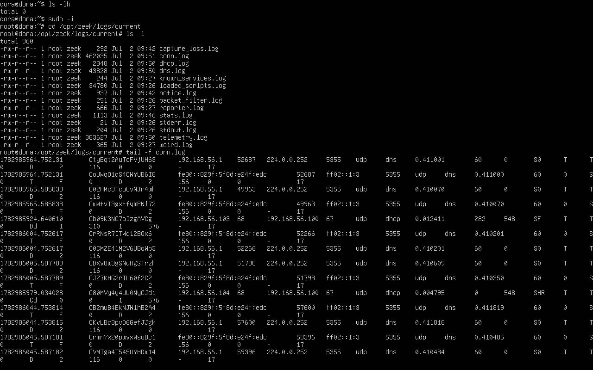

**Zeek results on ping sweep:**
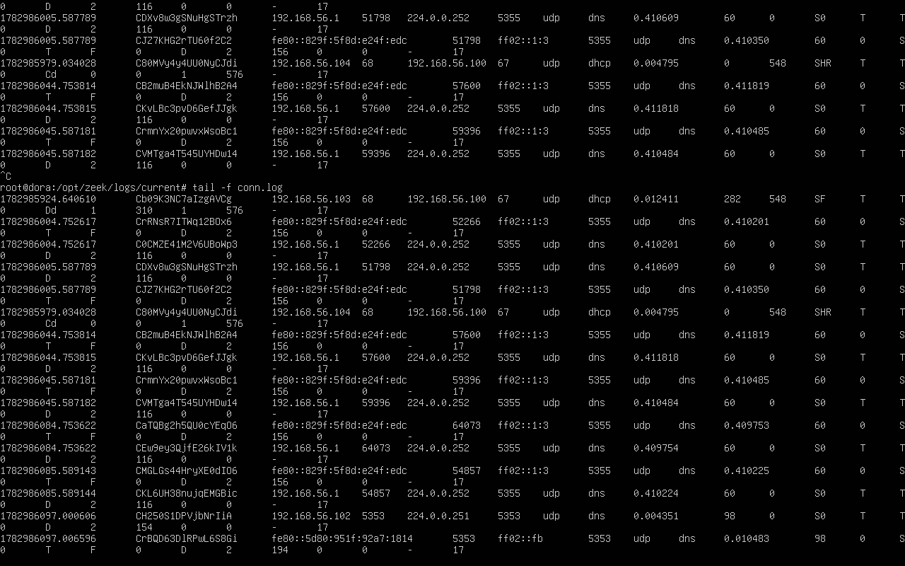

**Zeek results on nmap SYN scan (S0 pattern):**
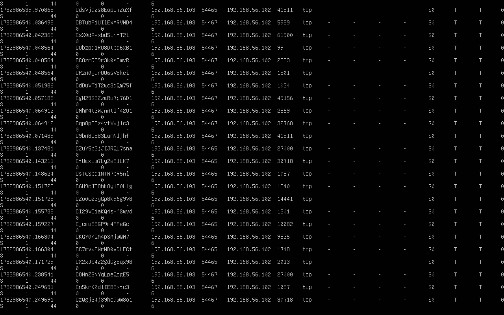

**tcpdump cross-verification:**
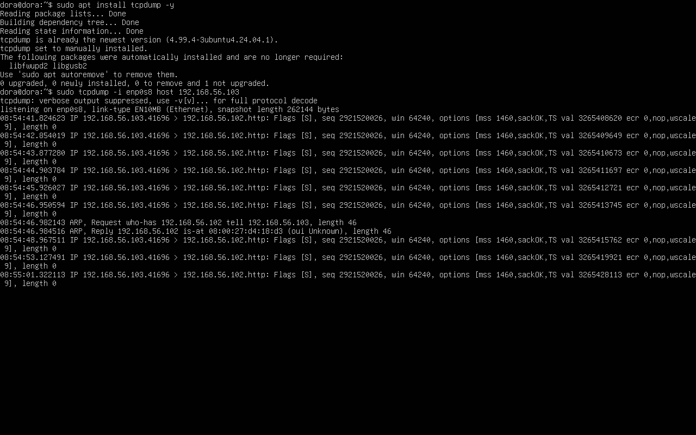

---

## 🧩 Challenges Faced & Solutions

Every stage of this build hit a real obstacle. Documenting them was, honestly, where most of the learning happened.

| # | Challenge | Root Cause | Solution |
|---|---|---|---|
| 1 | Unsure which Ubuntu ISO to use | N/A | Chose Ubuntu Server 24.04.4 LTS (amd64) — lightweight, CLI-only, lower resource footprint than Desktop, ideal for a sensor |
| 2 | VMs couldn't communicate | Only one adapter configured | Gave every VM two adapters: NAT (internet) + Host-Only (internal lab traffic) |
| 3 | Kali showed no host-only IP | Adapter 2 not enabled in VirtualBox | Enabled it and rebooted — `eth1` appeared with a `192.168.56.x` address |
| 4 | Kali randomly lost its NAT address | Interface dropped by NetworkManager | `sudo nmcli device connect eth0`, verified with `ip a` |
| 5 | Windows ↔ Kali ping failed (100% loss) | Routing/ARP looked fine (`nmap -sn` showed host up) — actual cause was Windows Firewall blocking ICMP | Enabled *File and Printer Sharing (Echo Request – ICMPv4-In)* in Windows Defender Firewall |
| 6 | Interface names didn't match across OSes | Ubuntu uses `enp0s3/enp0s8`, Kali uses `eth0/eth1` | Verified actual names per-OS with `ip a` before every config change |
| 7 | `Package zeek has no installation candidate` | Ubuntu's default repos don't ship current Zeek | Added the official Zeek OpenSUSE Build Service repo, installed Zeek 8.0 directly |
| 8 | Suricata crashed: `ioctl: Failure ... for 'eth0': No such device` | `suricata.yaml` still referenced the wrong interface in several places | `grep`'d the config for every interface reference, updated all to `enp0s8`, validated with `suricata -T -c ... -v` — 50,896 signatures loaded clean |
| 9 | Postfix install prompt interrupted Zeek setup | Zeek pulls in a mail transfer agent as a dependency | Selected **"Local Only"** — sufficient for a single-host home lab |
| 10 | Zeek wasn't seeing any lab traffic | `node.cfg` still pointed at the NAT interface (`eth0`) instead of the host-only NIC | Changed `interface=` to `enp0s8` in `/opt/zeek/etc/node.cfg`, redeployed with `zeekctl deploy` |
| 11 | Corrupted Zsh history on Kali | Unclean shutdown | Removed the corrupted history file, let Zsh regenerate it (no impact on lab data) |

---

## 🧠 MITRE ATT&CK Mapping

| Technique | ID | Evidence |
|---|---|---|
| Network Service Scanning | T1046 | `nmap -sS/-sV`; Zeek's `S0` burst pattern |
| Active Scanning — IP Blocks | T1595.001 | `nmap -A`; Suricata ICMPv4 alert |
| System Information Discovery | T1082 | Nmap OS fingerprint: Windows 10 Pro 17763 |
| SMB / Windows Admin Shares | T1021.002 | Suricata SMB dialect alerts (rule 2225005) |
| NTLM Relay / Auth Probe | T1557.001 | Suricata NTLM chain (rules 2067085/86/87) |
| Attacker Identity Exposure | T1016 | Kali hostname leaked in DHCP request (rule 2022973) |

---

## 🔑 Key Findings

1. **Attackers expose themselves before the first attack packet.** Kali's hostname leaked in its own DHCP broadcast — a Priority 1 Suricata alert, and the first pivot indicator in a real investigation.
2. **Nmap SYN scans have an unmistakable Zeek fingerprint.** Hundreds of `S0` connections to sequential ports in under a second, from one source — detectable purely by behavior, no signature needed.
3. **Port 445 (SMB) is a rich alert surface.** A single nmap SMB interaction triggered three separate Suricata rules: malformed dialect, applayer mismatch, and an NTLM auth chain.
4. **NTLMv1 was still active on the Windows 10 target** — a known relay-attack weakness. Real-world hardening recommendation: enforce NTLMv2 minimum via Group Policy.
5. **Suricata and Zeek are complementary, not redundant.** Suricata answers *what* (known-bad signatures); Zeek answers *how* (connection state, timing, byte counts). A SOC analyst needs both to build a complete picture.

---

## 🚀 How to Replicate This Lab

```bash
# 1. Host-only network
VirtualBox → File → Network Manager → Host-Only Networks
Subnet: 192.168.56.0/24 | DHCP: enabled (192.168.56.100)

# 2. Install Suricata (on the sensor VM)
sudo add-apt-repository ppa:oisf/suricata-stable
sudo apt update && sudo apt install suricata -y
sudo suricata-update
sudo suricata -T -c /etc/suricata/suricata.yaml -v
sudo systemctl enable --now suricata

# 3. Install Zeek (on the sensor VM)
sudo apt install zeek-8.0 -y
sudo nano /opt/zeek/etc/node.cfg     # interface=enp0s8
sudo zeekctl deploy

# 4. Attack from Kali
ping 192.168.56.102
sudo nmap -sS 192.168.56.102
sudo nmap -A  192.168.56.102
nmap -sV      192.168.56.102

# 5. Watch detections
sudo tail -f /var/log/suricata/fast.log
cd /opt/zeek/logs/current && tail -f conn.log
sudo tcpdump -i enp0s8 host 192.168.56.103
```

---

## 📁 Repository Structure

```
soc-home-lab/
├── README.md
└── screenshots/
    ├── server_ip.png
    ├── kali_ip.png
    ├── windows_10_ip.png
    ├── ubuntu_can_talk.png
    ├── kali_talk.png
    ├── windows_can_talk.png
    ├── suricata_installed.png
    ├── suricata_configuration.png
    ├── suricata_troubleshoot.png
    ├── suricata_running.png
    ├── installing_zeek.png
    ├── conf_zeek.png
    ├── generating_traffic.png
    ├── kali_ping_flood.png
    ├── nmap_scan_on_target.png
    ├── nmap_sV_results.png
    ├── zeek_on_kali.png
    ├── suricata_results.png
    ├── ubuntu_capturing.png
    ├── zeek_results.png
    ├── zeek_results_on_ping.png
    ├── zeek_nmap.png
    └── tcpdump_results.png
```

---

## 👤 About Me

**Malathi Mittapalli (Enola)** — Aspiring SOC Analyst | VAPT Enthusiast | Blue Team & Threat Hunting

6 months of hands-on cybersecurity internship experience covering network/packet analysis, IDS/firewall operations, VAPT, web application security, and SOC operations. This lab was built end-to-end — from network design and tool installation through live attack simulation, detection, and MITRE-mapped analysis — to demonstrate the kind of hands-on blue team skill a SOC Tier 1 role requires on day one.

[](https://linkedin.com/in/malathi-mittapalli-enola-b73208413)
[](https://github.com/malathi-cyber-sketch)

---

*MIT License — free to use, fork, and build on.*
